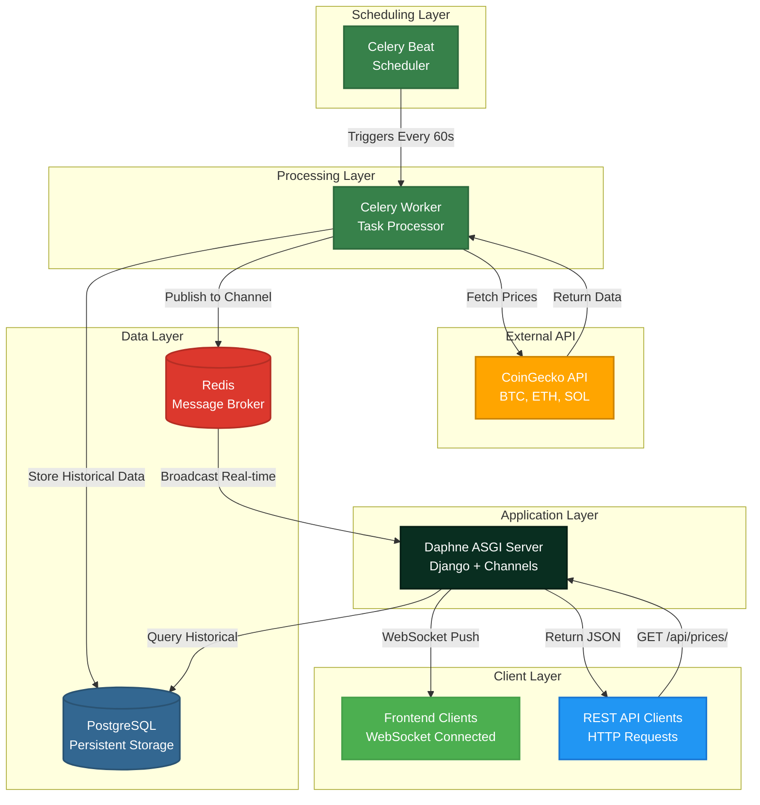

# 📈 Real-Time Financial Data Aggregator API

<div align="center">

[](https://www.python.org/)
[](https://www.djangoproject.com/)
[](https://www.django-rest-framework.org/)
[](https://docs.celeryq.dev/en/stable/)
[](https://redis.io/)
[](https://www.postgresql.org/)
[](https://hub.docker.com/repository/docker/mohammed237/financial-api/general)
[](https://developer.mozilla.org/en-US/docs/Web/API/WebSockets_API)

</div>

<p align="center">
A high-performance, asynchronous distributed system that aggregates real-time cryptocurrency data from CoinGecko. The system features a background processing engine for automated data fetching, a REST API for historical analysis, and WebSocket channels for instant live price updates.
</p>

<p align="center">
<strong>Built to demonstrate production-grade System Design patterns:</strong> Asynchronous Task Processing, Message Brokering, Real-Time Communication, and Containerized Deployment.
</p>

---

## 🛠️ Tech Stack & Architecture

| Component                | Technology                                   |
| ------------------------ | -------------------------------------------- |
| **Core Framework**       | Django & Django REST Framework (DRF)         |
| **Real-Time Engine**     | Django Channels (WebSockets) & Daphne (ASGI) |
| **Asynchronous Workers** | Celery (Distributed Task Queue)              |
| **Message Broker**       | Redis                                        |
| **Database**             | PostgreSQL                                   |
| **Containerization**     | Docker & Docker Compose                      |

### System Architecture Flow



**How it works:**

1. **Celery Beat** triggers a scheduled task every 60 seconds
2. **Celery Worker** fetches the latest cryptocurrency prices (Bitcoin, Ethereum, Solana) from the CoinGecko API
3. **PostgreSQL** stores the data for historical persistence and analysis
4. **Redis** acts as a message channel layer, instantly broadcasting new prices to the WebSocket group
5. **Daphne** pushes real-time updates to all connected frontend clients via WebSockets
6. **REST API clients** can query historical data through HTTP endpoints

---

## 🚀 Installation & Deployment

This project is **fully containerized**. You do not need to install Python, Redis, PostgreSQL, or any dependencies manually.

### Option 1: Quick Start (Production Image)

Use this method to run the system immediately using pre-built Docker images.

#### 1. Create the Compose File

Create a file named `docker-compose.yml` in your project directory and paste the production configuration from [here](docker-compose-production.yml).

> **Note:** Ensure the `image:` line points to the correct Docker Hub repository [mohammed237/financial-api:v1](https://hub.docker.com/repository/docker/mohammed237/financial-api/general)

#### 2. Start the System

Run the application in detached mode (runs in background):

```bash
docker-compose up -d
```

Docker will automatically pull the pre-built images from Docker Hub and start all services.

#### 3. Initialize Database

Apply database migrations to create the required schema:

```bash
docker-compose exec web python manage.py migrate
```

#### 4. Create Admin User (Optional)

To access the Django Admin panel at `http://127.0.0.1:8000/admin`:

```bash
docker-compose exec web python manage.py createsuperuser
```

Follow the prompts to create your admin credentials.

#### 5. Verify Installation

- **API Health Check:** Visit `http://127.0.0.1:8000/api/prices/`
- **Admin Panel:** Visit `http://127.0.0.1:8000/admin`
- **WebSocket Test:** Use a WebSocket client to connect to `ws://127.0.0.1:8000/ws/prices/?token=YOUR_TOKEN`

---

### Option 2: Development (Build from Source)

If you want to modify the code or contribute to the project:

#### 1. Clone the Repository

```bash
git clone https://github.com/yourusername/financial-aggregator.git
cd financial-aggregator
```

#### 2. Build and Start Services

```bash
docker-compose -f docker-compose.yml up --build
```

This will build the Docker images from source and start all services with development settings (hot-reload enabled).

#### 3. Run Migrations

```bash
docker-compose -f docker-compose.yml exec web python manage.py migrate
```

---

## 🔌 API Documentation

For easy exploration and testing of the API, this project includes a **Swagger UI**. Visit `/api/docs/` in your browser to view the interactive documentation.

### 1. HTTP REST API

#### Get Historical Price Data

**Endpoint:** `GET /api/prices/`

**Query Parameters:**
| Parameter | Type | Description | Example |
|-----------|------|-------------|---------|
| `symbol` | string | Filter by cryptocurrency symbol | `bitcoin`, `ethereum`, `solana` |
| `from_date` | date | Filter records from this date onwards | `2025-01-01` |
| `to_date` | date | Filter records up to this date | `2025-12-31` |
| `limit` | integer | Limit number of results | `100` |

**Example Request:**

```bash
curl "http://localhost:8000/api/prices/?symbol=bitcoin&from_date=2025-01-01"
```

**Example Response:**

```json
{
  "count": 520,
  "next": "http://localhost:8000/api/prices/?page=2",
  "previous": null,
  "results": [
    {
      "id": 520,
      "asset_symbol": "BTC",
      "price": "89450.00",
      "timestamp": "2025-12-15T16:42:28Z"
    },
    {
      "id": 519,
      "asset_symbol": "BTC",
      "price": "89320.50",
      "timestamp": "2025-12-15T16:41:28Z"
    }
  ]
}
```

---

### 2. Real-Time WebSocket API

#### Connect to Live Price Feed

**Endpoint:** `ws://localhost:8000/ws/prices/`

**Authentication:**
This endpoint requires token authentication. Include your token as a query parameter:

```
ws://localhost:8000/ws/prices/?token=YOUR_AUTH_TOKEN
```

**How to get a token:**

1. Create a user account (via Django Admin or registration endpoint)
2. Generate a token using Django REST Framework's token authentication
3. Or use the command: `docker-compose exec web python manage.py drf_create_token <username>`

**Message Format (Server → Client):**

```json
{
  "symbol": "BTC",
  "price": "89450.00",
  "timestamp": "2025-12-15 16:42:28+00:00"
}
```

---

## 📊 Supported Cryptocurrencies

Currently tracking:

- **Bitcoin (BTC)**
- **Ethereum (ETH)**
- **Solana (SOL)**

To add more cryptocurrencies, modify the Celery [tasks](app/tasks.py) configuration and add the CoinGecko API IDs to **TARGET_ASSETS**.
